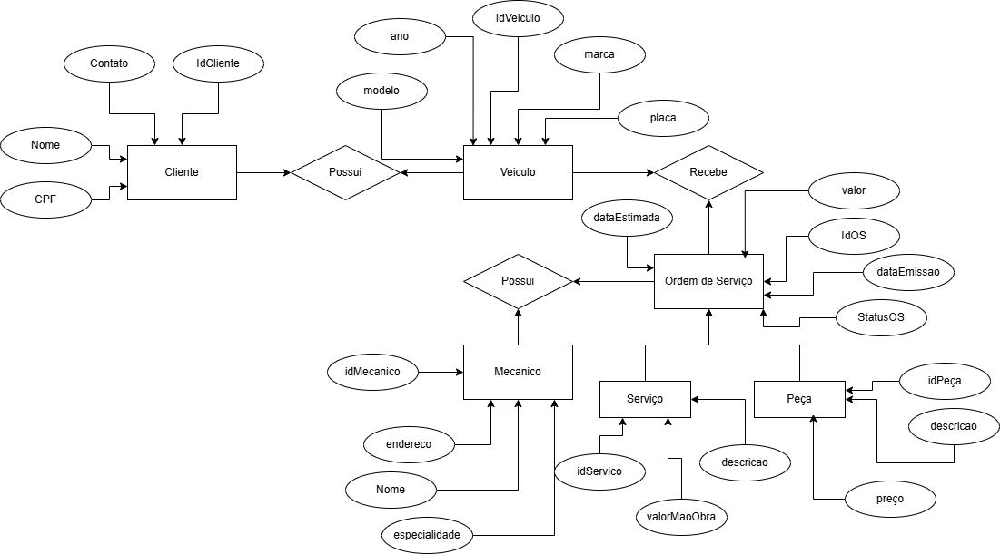

# 🚗 Sistema de Ordem de Serviço para Oficina Mecânica

Este repositório contém o modelo conceitual do banco de dados para um **Sistema de Ordem de Serviço** de uma oficina mecânica. O sistema permite gerenciar clientes, veículos, mecânicos, serviços e peças utilizadas.

## 📌 Modelo Conceitual

- **Cliente**: Contém informações como nome, CPF e contato.
- **Veículo**: Relacionado a um cliente, com atributos como marca, modelo, ano e placa.
- **Mecânico**: Possui especialidade, endereço e nome.
- **Ordem de Serviço**: Documento que registra serviços prestados a um veículo, incluindo:
  - Data de emissão
  - Status da OS
  - Valor total
  - Data estimada para conclusão
- **Serviço**: Tarefa realizada no veículo, incluindo descrição e valor da mão de obra.
- **Peça**: Componentes utilizados nos serviços, com descrição e preço.

### 🔗 Relacionamentos:

- Um **cliente** pode possuir **vários veículos**.
- Um **veículo** pode receber **várias ordens de serviço**.
- Uma **ordem de serviço** pode envolver **múltiplos serviços e peças**.
- Um **mecânico** pode estar associado a uma ou mais **ordens de serviço**.

## 📷 Diagrama Entidade-Relacionamento

Abaixo está o diagrama entidade-relacionamento do sistema:

